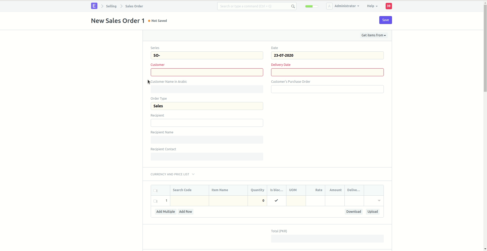
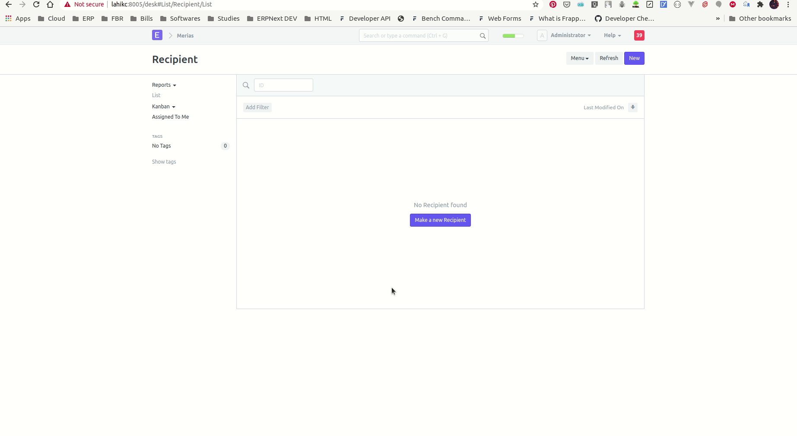

# Functionality
When creating a Sales Order. All Items are blocked by default for the qty mentioned. It the quantity available is less than the quantity block, the system will not allow to create Sales Order.
### Preventing Sales Order if Qty not available

 

# Linked Documents
<ol>
    <li>Recipient</li>
    <li>Release Blocked Item</li>
</ol> 

  

## Recipient Document
Create new recipient to add in the Sales Order. It has two fields
<ol>
    <li>Recipient Name</li>
    <li>Recipient Contact</li>
</ol>

## Release Blocked Item Document
There can be a scenario where you want to release items blocked by one Sales Order and use it elsewhere. In that case release blocked item document will be created for the sales order that has blocked the items.
  
